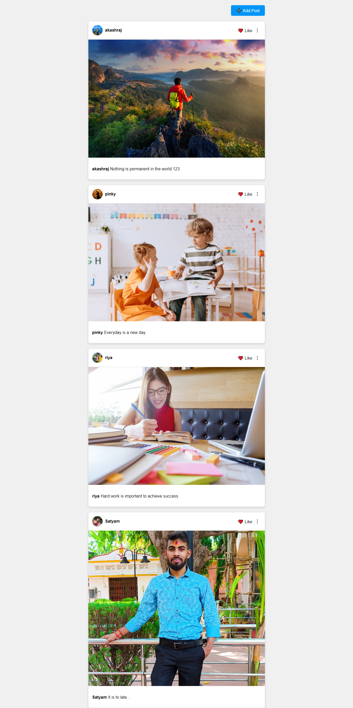

<h1>Instagram Web Clone</h1>

This is a simple Instagram-like web application built with Node.js and MySQL. The app allows users to perform CRUD (Create, Read, Update, Delete) operations on posts. Users can add posts, edit them, view all posts, and delete posts, all while interacting with a MySQL database for persistent storage.

<h2>Features</h2>
<ul>
  <li><b>Responsive Design:</b> Optimized for both desktop and mobile devices.</li>
  <li>Create new posts with images and captions.</li>
  <li>View all posts on a feed.</li>
  <li>Edit existing posts.</li>
  <li>Delete posts.</li>
  <li>MySQL database used for data storage.</li>
</ul>

<h2>Technologies Used</h2>
<ul>
  <li><b>Backend :</b> Node.js (Express.js).</li>
  <li><b>Frontend :</b> EJS (Embedded JavaScript) for templating.</li>
  <li><b>Database :</b> MySQL.</li>
  <li><b>API :</b> Used for fetching data and rendering posts dynamically.</li>
</ul>

<h2>Demo</h2>

Link to demo

<h2>Installation</h2>
Clone the repository:

bash
Copy code
git clone https://github.com/yourusername/spotify-web-player-clone.git
cd instagram-clone
<h3>Configure MySQL database:</h3>
<ul>
  <li>Configure MySQL database:</li>
  <li>Import the provided database.sql file to set up the database structure.</li>
  <li>Update your database connection settings.</li>
</ul>
setup the database from sample sql file.
Open the project:
Nevigae he same repositry sart the server from terminal (command: nodemon index.js).

<h2>Usage</h2>
<ol>
  <li><b>Adding a Post :</b> Navigate to the "Add New Post" page, upload an image, and add a caption.</li>
  <li><b>Editing a Post:</b> Click on the "Edit" button on a post to update its details.</li>
  <li><b>Deleting a Post:</b> Use the "Delete" button to remove a post from the feed.</li>
  <li><b>Viewing Posts:</b> The main feed displays all user posts fetched from the database.</li>
</ol>

<h2>Fork the repository.</h2>
<ul>
  <li>Create a new branch (git checkout -b feature/your-feature-name).</li>
  <li>Commit your changes (git commit -m 'Add some feature').</li>
  <li>Push to the branch (git push origin feature/your-feature-name).</li>
  <li>Open a Pull Request.</li>
  <li>Please make sure your code follows the project's coding standards.</li>
</ul>

<h2>License</h2>
This project is licensed under the MIT License. See the LICENSE file for more details.

<h2>Acknowledgements</h2>
Instagram for the inspiration.
Font Awesome for icons used in the project.
<h2>Contact</h2>
If you have any questions, feel free to reach out:

Email: akash703315@gmail.com
GitHub: Its-Verma
